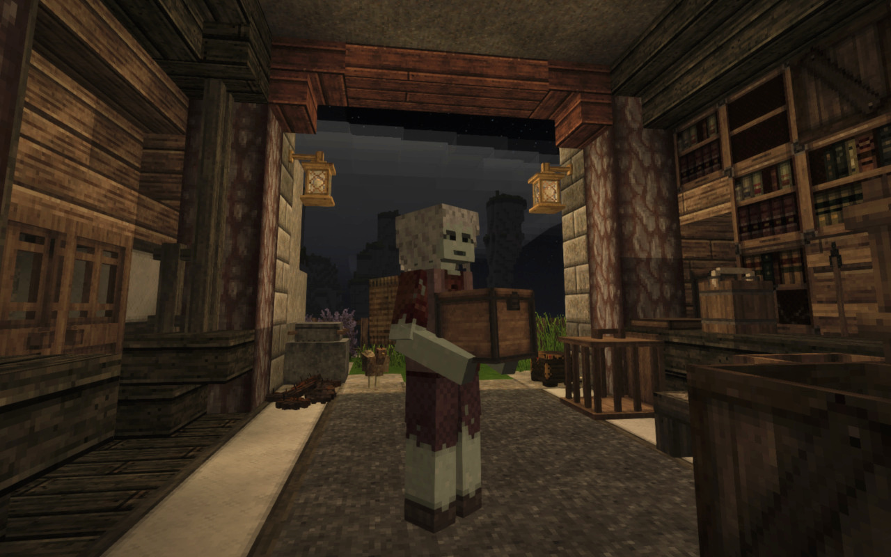

# CarryCapacity

.. is a [*Vintage Story*][VS] mod which allows picking up blocks, especially
containers along with their contents, to carry them in your hands and on your
back. Inspired by my Minecraft mod [*Wearable Backpacks*][WBs] as well as
*Charset*, *CarryOn* and similar.



[VS]: https://www.vintagestory.at/
[WBs]: https://github.com/copygirl/WearableBackpacks

## Download

Available right here on [GitHub Releases][DL].

[DL]: https://github.com/copygirl/CarryCapacity/releases

## Usage

The only control in this mod is **sneaking** and **holding right click**.  
If you're doing things right, you will see a circle that fills up over time.

- While empty-handed, you can pick up blocks.
- With something in-hand, place it down on the side of a **solid block**.
- Or put what you're carrying on your back by instead aiming in the air.
- Grab what's on your back into your hands again while holding nothing.

Carrying something in-hand slows you down and prevents you from sprinting. On
your back, the slowdown is less dramatic. The exact amount depends on the type
of block, though. For example chests will slow you down by 40% (in hands) / 15%
(on back), which is the default, while the lighter baskets only do so by 20%
in-hand and not at all on your back.

The time it takes to interact with a carryable block also depends on the type.
Additionally, placing takes a little less time (-25%) than picking up, and
interacting with your back is quite a bit slower (+50%).

## Modding

The block behavior `Carryable` is [retroactively added](patch) to chests and
baskets. But it is possible to add it to additional blocks. Simply insert it at
the top of the behavior list of custom blocks like in the following example, or
use the patching system to add it to existing blocks like I do.

```json
behaviors: [
  { name: "Carryable", properties: {
    interactDelay: 0.8,
    
    translation: [ 0, 0, 0 ],
    rotation: [ 0, 0, 0 ],
    origin: [ 0.5, 0.5, 0.5 ],
    scale: [ 0.5, 0.5, 0.5 ],
    
    slots: {
      "Hands": {
        animation: "carrycapacity:holdheavy",
        walkSpeedModifier: 0.6,
        
        translation: [ 0, 0, 0 ],
        rotation: [ 0, 0, 0 ],
        origin: [ 0.5, 0.5, 0.5 ],
        scale: [ 0.5, 0.5, 0.5 ],
      },
    }
  } },
  { name: "Container" },
  ...
]
```

The properties and each of the entries are optional, reverting to the
defaults shown here if not present.

[patch]: https://github.com/copygirl/CarryCapacity/blob/master/resources/assets/carrycapacity/patches/carryable.json
