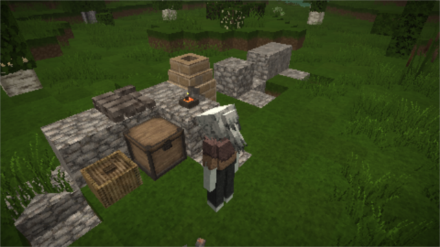
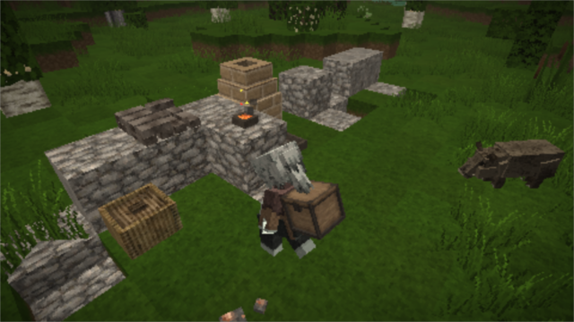

# CarryCapacity

.. is a [Vintage Story][VS] mod which allows picking up blocks, especially
containers along with their contents, to carry them on your back. Inspired by
my Minecraft mod [Wearable Backpacks][WBs].






## Usage

To carry a supported block or container, point your cursor at it and right
click while sneaking with an empty hand. To place it back down, point your
cursor on top of a solid block and, again, right click it while sneaking with
an empty hand.

## Download

Available right here on [GitHub Releases][DL].

## Behavior

The block behavior `Carryable` is retroactively added to chests and baskets.
But it is possible to add it to additional blocks. Simply insert it at the
top of the behavior list like so:

```json
behaviors: [
  { name: "Carryable", properties: {
    translation: [ 0, 0, 0 ],
    rotation: [ 0, 0, 0 ],
    origin: [ 0, 0, 0 ],
    scale: 0.55,
  } },
  { name: "Container" },
  ...
]
```

The properties and each of the entries are optional, reverting to the
defaults shown here if not present.

[VS]: https://www.vintagestory.at/
[WBs]: https://github.com/copygirl/WearableBackpacks
[DL]: https://github.com/copygirl/CarryCapacity/releases
